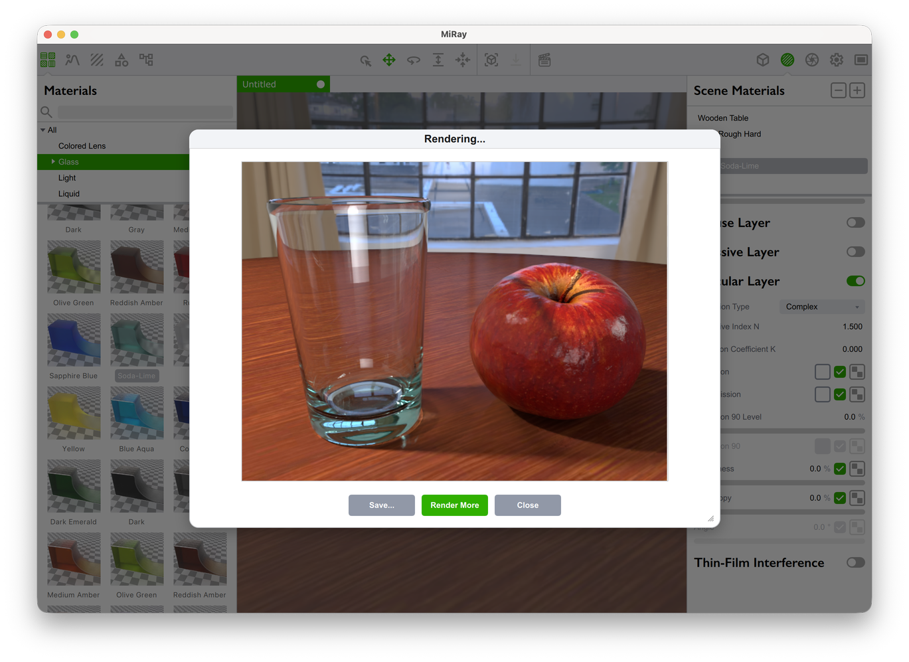

# MiRay2

Physically correct, unbiased rendering engine with advanced layered materials, volumetric transport, and AI-accelerated denoising.



---

## Features

### Rendering Core & Algorithms
- **Volumetric Path Tracing (VPT)**: Physically correct light transport with Next-Event Estimation (NEE), Multiple Importance Sampling (MIS, balance heuristic), and Russian roulette path termination.
- **Unified Points, Beams, and Paths (UPBP)**: Progressive photon mapping integrating Bidirectional Path Tracing (BPT), surface photon mapping (SURF), 3D volumetric photon points (PP3D), 2D photon beams (PB2D), and 1D beam-beam radiance estimates (BB1D / BRE). Robustly resolves challenging specular-diffuse-specular (SDS) paths, water/glass caustics, and volumetric light shafts.
- **High-Performance Acceleration**: Powered by Intel Embree 4 BVH kernels with multi-threaded, lock-free tile scheduling.
- **Low-Discrepancy Samplers**: Sobol quasi-Monte Carlo sequence (with precomputed high-dimensional direction matrices) and Halton sampler for rapid low-noise convergence.
- **AI Denoising (OIDN 2.x)**: Integrated Intel OpenImageDenoise with Apple Metal GPU acceleration on macOS Apple Silicon and optimized multi-threaded CPU execution, utilizing Albedo and Shading Normal auxiliary guide buffers.
- **Multi-Channel Render Passes (AOVs)**: Beauty, Albedo, Shading Normals, Depth (Z-depth), Object IDs, Material IDs, and Render Layers.

### Layered Materials & Optics (BSDF)
- **Hierarchical Layered Architecture**: Composable material groups and layers with individual opacity masks, blending modes, and bump mapping.
- **Microfacet Specular Models**: Trowbridge-Reitz (GGX) and Beckmann distributions with Visible Normal Distribution Function (VNDF) sampling.
- **Anisotropic Roughness**: Independent roughness and anisotropy parameters with controllable orientation angle and texture mapping.
- **Measured Spectral Data & Complex IOR**:
  - Direct import of real-world optical measurements (`refractiveindex.info` formats, `filmetrics.com`, Maxwell Render `.ior`, SOPRA `.nk`).
  - Conversion from spectral wavelengths (CIE XYZ) to RGB color space.
  - Complex Fresnel equations supporting dielectric and conductor ($n, k$) materials.
  - Grazing angle reflection tint (**Reflection 90°** / edge tint and falloff curve).
- **Thin-Film Interference (Iridescence)**: Physical wave-optics simulation (Airy equations) calculating phase shifts and reflectance across wavelengths based on nanometer film thickness and refractive indices.
- **Volumetric Media & Subsurface Scattering (SSS)**:
  - Volumetric absorption (Beer-Lambert law) and volumetric emission.
  - Subsurface scattering with Henyey-Greenstein phase function (isotropic, forward, or backward scattering).
  - Nested dielectric priority tracking for robust overlapping transparent media (e.g. ice in liquid).
- **Surface Displacement & Detail**:
  - Tangent-space Normal Mapping.
  - Steep Parallax Mapping / Relief Mapping with binary search refinement and self-shadowing.
  - Oren-Nayar and Lambertian diffuse models with diffuse translucency / transmission.
- **Double-sided Geometry**: Configurable two-sided or single-sided surface shading.

### Lighting & Environment
- **Image-Based Lighting (IBL)**: High Dynamic Range (HDRI / EXR) spherical environment maps with 360° horizontal/vertical rotation, scale, and MIS sampling.
- **Multiple Background Modes**: Environment projection, transparent alpha cutout, planar images, spherical images, and gradient backdrops (radial, vertical, horizontal).
- **Analytic & Area Lights**:
  - Directional Sun light with tunable angular diameter for realistic soft shadows.
  - Spherical / Point lights with physical radius and inverse-square falloff.
  - Emissive Geometry lights with CDF triangle importance sampling.
- **Virtual Studio Floor**: Ground plane with shadow catcher and tunable glossy reflections.

### Camera & Optics
- **Lens Projections**: Perspective, Orthographic, Spherical (360° Equirectangular panorama), Cylindrical, and Fisheye.
- **Physical Depth of Field (DoF)**: Thin-lens camera model with f-stop, interactive click-to-focus distance, polygonal diaphragm aperture (3–32 blades), and bokeh rotation.
- **Snapshots & Interpolation**: Scene state snapshots capturing camera pose, object transforms, materials, visibility, and lighting, with smooth transition interpolation and motion blur.

### Asset Formats & Ecosystem
- **3D Geometry Import**: glTF / GLB, FBX, OBJ, Blender (.blend), Collada (.dae), 3DS, STL, PLY, DXF (via Assimp).
- **Image I/O**: OpenEXR, Radiance HDR, TIFF, PNG, JPEG, PSD, BMP, PFM.
- **Color Management**: Accurate color space conversion and ICC profile handling via Skia CMS (`skcms`).
- **Asset Library**: Bundled material presets, studio environments, and Poly Haven CC0 HDRIs and assets.

---

## Quick Start

The repository includes a root [Makefile](Makefile) with cross-platform targets for common development workflows:

```bash
# 1. Install Conan dependencies, configure CMake, and build
make build

# 2. Run unit test suites
make test

# 3. Package standalone application
make app

# 4. Launch the compiled MiRay application
make run

# 5. Generate native IDE project (Xcode on macOS, Visual Studio on Windows)
make project

# 6. Clean build outputs (bin/, tmp/)
make clean
```

### Build Modifiers

You can select target architecture and configuration via modifiers:
```bash
make arm release build   # macOS Apple Silicon (RelWithDebInfo)
make intel debug build   # Intel/AMD x86_64 (Debug)
make debug test          # Run tests with Debug configuration
```

---

## IDE Projects (Xcode & Visual Studio 2022)

To generate native IDE project files (auto-detects host CPU architecture and platform by default):

```bash
make project                # Generate Xcode project (macOS) or VS solution (Windows) in Debug
make release project        # Generate with RelWithDebInfo configuration
make both project           # Generate with both Debug and RelWithDebInfo dependencies
make intel project          # Force Intel/x64 architecture
make arm project            # Force Apple Silicon architecture
```

- **macOS (Xcode)**: `open tmp/MiRay.xcodeproj`
- **Windows (Visual Studio 2022)**: `start tmp\MiRay.sln`

---

For the full, in-depth documentation, please see: **[docs/build.md](docs/build.md)**

---

## Repository Structure

```
├── CMakeLists.txt         # Root Modern CMake 3.28+ project configuration
├── conanfile.py           # Conan 2 dependency specification and deployment logic
├── conan/                 # Conan profiles (mac-arm, mac-x64, win-x64)
├── Core/                  # Rendering core, math, materials, integrators, primitives
├── Core.Tests/            # GoogleTest unit tests for Core
├── Shared/                # Utilities, logging, thread pool, shared models
├── FormatModels3D/        # 3D model importer plugin (Assimp)
├── FormatModels3D.Tests/  # GoogleTest unit tests for 3D model importer
├── MiRay/                 # Qt GUI frontend, main window, render view, QML assets
├── Resources/             # Scene library, shapes, materials, and preview assets
├── tools/                 # App bundling and build configs
│   ├── mac/               # bundle.sh (macOS app bundling)
│   └── win/               # bundle.cmd (Windows app bundling), version.rc.in, qt.conf
├── docs/
│   └── build.md           # Comprehensive build and distribution documentation
└── Makefile               # Development CLI shortcuts
```

---

## License

This project is licensed under the MIT License - see the [LICENSE](LICENSE) file for details.
